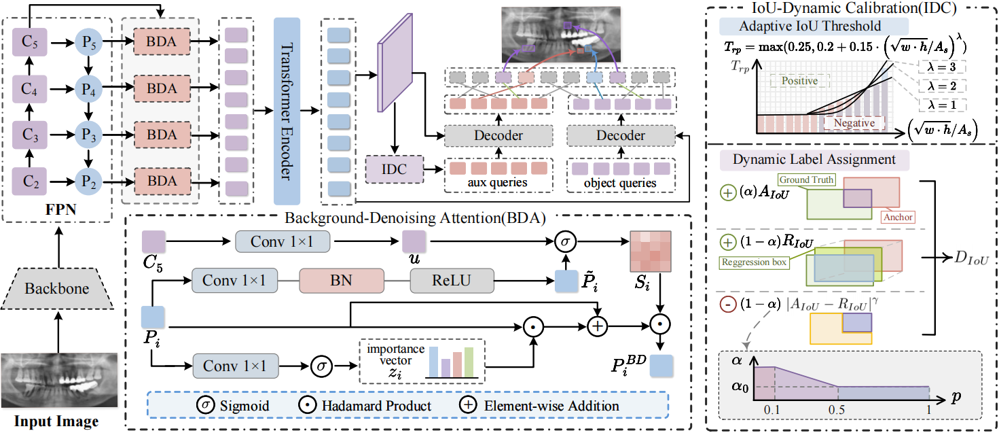

# [MICCAI 2025] PerioDet: Large-Scale Panoramic Radiograph  Benchmark for Clinical-Oriented Apical  Periodontitis Detection

> Authors: Xiaocheng Fang, Jieyi Cai, Huanyu Liu, Chengju Zhou, Minhua Lu, Bingzhi Chen.

### Abstract:

Apical periodontitis is a prevalent oral pathology that presents significant public health challenges. Despite advances in automated diagnostic systems across various medical fields, the development of Computer-Aided Diagnosis (CAD) applications for apical periodontitis is still constrained by the lack of a large-scale, high-quality annotated dataset. To address this issue, we release a large-scale panoramic radiograph benchmark called "PerioXrays", comprising 3,673 images and 5,662 meticulously annotated instances of apical periodontitis. To the best of our knowledge, this is the first benchmark dataset for automated apical periodontitis diagnosis.  This paper further proposes a clinical-oriented apical periodontitis detection PerioDet paradigm, which jointly incorporates Background-Denoising Attention (BDA) and IoU-Dynamic Calibration (IDC) mechanisms to address the challenges posed by background noise and small targets in automated detection. Extensive experiments on the PerioXrays dataset demonstrate the superiority of PerioDet in advancing automated apical periodontitis detection. Additionally, a well-designed human-computer collaborative experiment underscores the clinical applicability of our method as an auxiliary diagnostic tool for professional dentists.



### Download PerioXrays Dataset:
```
https://huggingface.co/datasets/XiaochengFang/PerioXrays
```

### Please consider citing the following paper if you find this work useful for your research.

```
@inproceedings{fang2025PerioDet,
  title={PerioDet: Large-Scale Panoramic Radiograph  Benchmark for Clinical-Oriented Apical  Periodontitis Detection},
  author={Fang, Xiaocheng and Cai, Jieyi and Liu, Huanyu and Zhou, Chengju and Lu, Minhua and Chen, Bingzhi},
  booktitle={Proceedings of Medical Image Computing and Computer Assisted Intervention (MICCAI)},
  volume={xxx},
  number={xxx},
  pages={xxx--xxx},
  year={2025}
}
```

If you have any questions, please get in touch with us: fangxiaocheng162@gmail.com.
